# Project Overview
## AssistantPro - AI Personal Assistant SaaS Platform

**Created**: June 4, 2025  
**Status**: MVP Development Phase  
**Market Focus**: India → Southeast Asia → Global  
**Business Model**: B2C MVP → B2B2C API → Enterprise SaaS

---

## 🎯 **Executive Summary**

AssistantPro is a revolutionary privacy-first, culturally-aware AI personal assistant platform specifically engineered for emerging markets. Starting with India, we're building a comprehensive SaaS platform that combines conversational AI, financial intelligence, and educational assistance into a unified experience.

### **Core Value Proposition**
- **Cultural Intelligence**: AI that understands Indian communication patterns, languages, and cultural nuances
- **Privacy-First**: All personal data processed in indian private cloud storage
- **Offline-Capable**: Core functionality works without internet connectivity
- **API-First**: Ready-to-integrate AI platform for B2B customers

## 🏗️ **Platform Architecture**

### **Three Integrated AI Modules**

#### **🧠 Soch (Core AI Platform)**
*Conversational AI with emotional intelligence and cultural awareness*

- **Foundation Layer**: Complete Sarvam AI integration (STT, TTS, Translation, Chat)
- **Cross-Module Intelligence**: Unified AI context across all modules
- **Cultural Processing**: Hinglish with Indian context understanding
- **Status**: ✅ Production-ready with 7 AI cookbooks

#### **💰 Mudra (AI Personal Finance)**
*Automatic financial intelligence via SMS/email processing*

- **UPI Integration**: Automatic transaction detection from SMS
- **Offline-First**: Full functionality without internet connectivity
- **Voice Commands**: Natural language financial interactions
- **Status**: 🚧 Active development with complete UI designs

#### **📚 Sikshak (AI Educational Tutor)**
*Culturally-aware AI companion for personalized learning*

- **Adaptive Learning**: Age-appropriate education with cultural context
- **Financial Literacy**: Practical education using real expense data
- **Parent Dashboard**: Progress tracking and insights
- **Status**: 📋 Phase 2 ready with design specifications

## 🎯 **Target Markets & Positioning**

### **Primary Market: India (Phase 1)**
- **Addressable Market**: 750M+ smartphone users
- **Key Demographics**: Urban millennials, small business owners, students
- **Unique Advantages**: Hindi AI, UPI integration, cultural understanding
- **Go-to-Market**: Direct consumer app + FinTech partnerships

### **SaaS Expansion Strategy**

```mermaid
graph TD
    A[B2C MVP - India] --> B[B2B2C APIs - India]
    B --> C[Regional Expansion - SEA]
    C --> D[Enterprise SaaS - Global]
    
    A1[100K users] --> B1[₹1Cr ARR]
    B1 --> C1[5 countries]
    C1 --> D1[IPO Ready]
```

### **Revenue Model Evolution**

| Phase | Model | Revenue Source | Target |
|-------|-------|----------------|---------|
| **Phase 1** | Freemium | Premium features, ads | ₹10L ARR |
| **Phase 2** | API Platform | Usage-based pricing | ₹1Cr ARR |
| **Phase 3** | Enterprise SaaS | Subscription + Custom | ₹10Cr ARR |
| **Phase 4** | Global Platform | Multi-tier SaaS | ₹100Cr ARR |

## 🚀 **Competitive Advantages**

### **Technical Differentiation**
1. **Cultural AI**: First AI platform designed specifically for Indian cultural context
2. **Privacy Architecture**:  personal data in indian private cloud, aal 
3. **Offline Resilience**: Core features work without internet connectivity
4. **Integrated Intelligence**: Single AI engine powering all user interactions

### **Market Positioning**
1. **vs. Google Assistant**: Privacy-first, India-specific cultural understanding
2. **vs. Alexa**: Mobile-first, offline-capable, financial intelligence
3. **vs. Local Players**: Comprehensive platform vs. single-feature apps
4. **vs. Enterprise AI**: Ready-to-deploy, emerging market specialization

## 📊 **Business Model Canvas**

### **Key Partners**
- **Sarvam AI**: Core AI technology provider
- **Educational Institutions**: Sikshak deployment partners

### **Key Activities**
- AI model training and optimization
- Mobile app development and optimization
- API platform development
- Customer support and success

### **Key Resources**
- Proprietary cultural AI models
- Sarvam AI partnership
- Engineering and AI talent
- User data and insights (anonymized)

### **Value Propositions**

**For Consumers**:
- Culturally-aware AI assistant
- Privacy-first financial tracking
- Voice-enabled in Hinglish
- Works offline for core features

**For B2B Customers**:
- Ready-to-deploy AI platform
- Emerging market specialization
- API-first integration
- Proven cultural adaptation

### **Customer Relationships**
- **D2C**: Community-driven, social media engagement
- **B2B**: Dedicated customer success, technical support
- **Partners**: Co-marketing, joint development

### **Channels**
- **Direct**: Mobile app stores (Android/iOS)

### **Cost Structure**
- **AI Processing**: Sarvam AI API costs (variable)
- **Engineering**: Development team (fixed)
- **Infrastructure**: Cloud hosting, mobile backend (variable)
- **Marketing**: Customer acquisition, brand building (variable)

### **Revenue Streams**
1. **Freemium Subscriptions**: Premium features
3. **Enterprise Licenses**: Annual subscriptions

## 🎯 **Success Metrics & KPIs**

### **Phase 1 Targets (6 months)**
- ✅ **100+ Active Users**: Core functionality validation
- ✅ **95% UPI Detection**: SMS transaction parsing accuracy
- ✅ **<2s AI Response**: Voice query processing time
- ✅ **99.9% Privacy**: Zero personal data cloud storage

### **Business Metrics Progression**

| Metric | 6 Months | 12 Months | 24 Months | 36 Months |
|--------|----------|-----------|-----------|-----------|
| **Active Users** | 1K | 10K | 100K | 1M |
| **Revenue (Monthly)** | ₹50K | ₹5L | ₹50L | ₹5Cr |
| **Markets** | India | India | 5 Countries | 10+ Countries |
| **B2B Customers** | 0 | 10 | 100 | 1000+ |

## 🛠️ **Technology Stack Overview**

### **Mobile & Frontend**
- **Framework**: React Native (cross-platform efficiency)
- **UI Library**: NativeBase (Indian design patterns)
- **State Management**: Redux Toolkit
- **Local Storage**: SQLite with encryption

### **Backend & APIs**
- **API Services**: Node.js + Express
- **AI Processing**: Python + FastAPI
- **Database**: PostgreSQL (multi-tenant)
- **Cache**: Redis
- **Authentication**: Clerk

### **AI & Machine Learning**
- **Primary AI & Voice Processing**: Sarvam AI (Speech, Text, Translation)
- **Local Models**: TensorFlow Lite (offline processing)
- **Vector Database**: Chroma (semantic search)

### **Infrastructure & DevOps**
- **Cloud**: AWS (primary), multi-cloud ready
- **Containers**: Docker + Kubernetes
- **Monitoring**: Prometheus + Grafana
- **CI/CD**: GitHub Actions

## 🎯 **Investment Requirements**

### **Funding Stages**

| Stage | Amount | Timeline | Use of Funds | Milestones |
|-------|--------|----------|--------------|------------|
| **Pre-Seed** | ₹2Cr | Month 1-6 | MVP development, team | 1K users, working product |
| **Seed** | ₹10Cr | Month 7-18 | Market expansion, API platform | 10K users, ₹1Cr ARR |
| **Series A** | ₹50Cr | Month 19-30 | Regional expansion, enterprise | 100K users, 5 countries |
| **Series B** | ₹200Cr | Month 31-42 | Global expansion, IPO prep | 1M users, global presence |

### **Key Investor Value Propositions**
1. **Large Market**: 3B+ people in emerging markets needing AI assistance
2. **Technical Moat**: Cultural AI specialization and privacy architecture
3. **Platform Strategy**: Multiple revenue streams and expansion vectors
4. **Experienced Team**: Deep AI and emerging market expertise

## 🚧 **Risk Assessment**

### **Technical Risks**
- **AI Accuracy**: Continuous model improvement with user feedback
- **Scalability**: Gradual infrastructure scaling with user growth
- **Privacy Compliance**: Regular security audits and legal reviews

### **Market Risks**
- **Competition**: Focus on cultural differentiation and privacy
- **Regulatory**: Proactive compliance and government relations
- **Economic**: Diversified revenue and cost-flexible model

### **Mitigation Strategies**
- **Technology**: Multiple AI providers, open-source fallbacks
- **Market**: Early partnerships, regulatory engagement
- **Business**: Multiple revenue streams, conservative cash management

---

## 📋 **Next Steps**

### **For Developers**
1. Review [Technical Architecture](./technical-stack.md)
2. Set up [Development Environment](../03-IMPLEMENTATION/development-setup.md)
3. Explore [API Documentation](../05-REFERENCES/sarvam-ai-docs/)

### **For Business Stakeholders**
1. Review [MVP Specification](./mvp-specification.md)
2. Check [Development Roadmap](./development-roadmap.md)
3. Analyze [Market Positioning](../02-FEATURES/)

### **For Investors**
1. Study [Financial Projections](./mvp-specification.md#financial-projections)
2. Review [Competitive Analysis](./mvp-specification.md#competitive-landscape)
3. Examine [Technology Moats](./technical-stack.md)

---

*For questions or clarifications, see [Project Navigation Guide](../PROJECT-NAVIGATION.md)*
