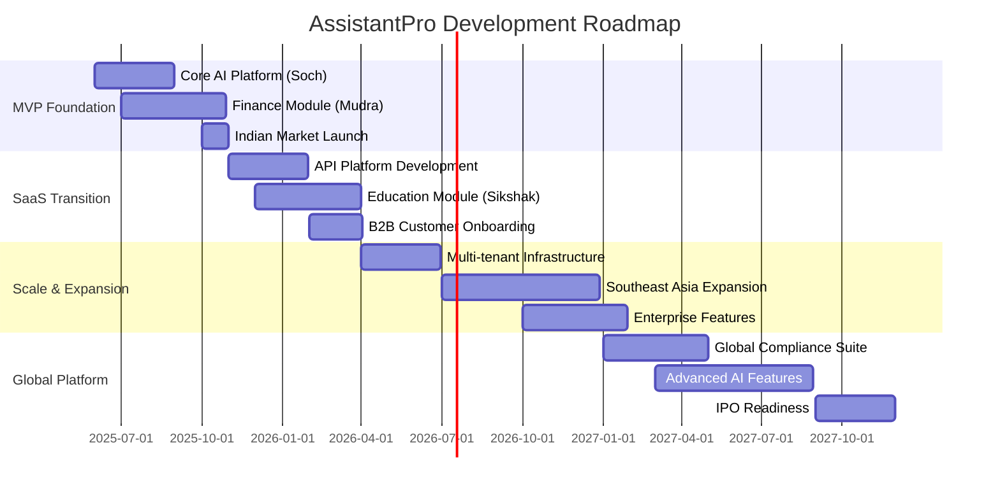

# AssistantPro Development Roadmap
## SaaS Platform Evolution Strategy

**Vision**: Become the leading AI platform for emerging markets  
**Mission**: Privacy-first, culturally-aware AI assistance for 1B+ users  
**Timeline**: 36-month roadmap to global SaaS leadership

---

## 🎯 **Strategic Phases Overview**

## 🚀 **Phase 1: MVP Foundation (Months 1-6)**
### **Goal**: Validate core AI platform with Indian consumers

#### **Month 1-2: Core AI Platform (Soch)**
- ✅ **Sarvam AI Integration**: Complete API integration with all models
- ✅ **Voice Processing Pipeline**: Speech-to-Text and Text-to-Speech
- ✅ **Cultural Context Engine**: Hindi/English processing with Indian context
- ✅ **Mobile App Foundation**: React Native base with offline capabilities

**Deliverables**:
- Working voice AI assistant with Indian language support
- 7 production-ready Sarvam AI cookbooks implemented
- Secure authentication and data encryption

**Success Metrics**:
- <2s voice response time
- 95%+ Hindi/English accuracy
- 99.9% uptime for core AI services

#### **Month 3-4: Financial Intelligence (Mudra)**
- 🚧 **SMS Transaction Parsing**: UPI and banking SMS automatic detection
- 🚧 **Offline-First Architecture**: Full functionality without internet
- 🚧 **Voice Financial Commands**: Natural language expense tracking
- 🚧 **Privacy-First Design**: Local encryption, zero cloud storage

**Deliverables**:
- Automatic UPI transaction detection from SMS
- Voice commands: "Add ₹500 grocery expense"
- Comprehensive transaction categorization
- Export capabilities for financial reports

**Success Metrics**:
- 95%+ UPI transaction detection accuracy
- <3s transaction processing time
- 100% data privacy compliance

#### **Month 5-6: Market Launch & Validation**
- 📋 **Beta Testing Program**: 100+ users in Indian market
- 📋 **Performance Optimization**: Mobile app performance tuning
- 📋 **User Feedback Integration**: Rapid iteration based on user data
- 📋 **App Store Launch**: Android and iOS store deployment

**Success Metrics**:
- 100+ active monthly users
- 4.5+ app store rating
- <10% churn rate
- Positive unit economics

---

## 💼 **Phase 2: SaaS Transition (Months 7-12)**
### **Goal**: Transform into B2B2C platform with API offerings

#### **Month 7-8: API Platform Development**
- 📋 **RESTful API Suite**: Complete API for all AI capabilities
- 📋 **Developer Portal**: Documentation, SDKs, and testing tools
- 📋 **Multi-Tenant Architecture**: Shared infrastructure, isolated data
- 📋 **Usage Analytics**: Real-time monitoring and billing

**Deliverables**:
- Comprehensive API documentation
- Partner integration SDKs (React, Flutter, iOS, Android)
- Developer onboarding flow
- Usage-based pricing model

**Target Customers**:
- Indian FinTech startups needing Hindi AI
- Educational technology companies
- Regional banks wanting AI customer service

#### **Month 9-10: Educational Module (Sikshak)**
- 📋 **Adaptive Learning Engine**: Personalized education with AI
- 📋 **Cultural Learning Adaptation**: Indian education system alignment
- 📋 **Financial Literacy Integration**: Using real Mudra data for practical learning
- 📋 **Parent/Teacher Dashboards**: Progress tracking and insights

**Deliverables**:
- Age-appropriate AI tutor (5-18 years)
- Integration with Indian curriculum standards
- Real financial data for practical money management education
- Teacher and parent monitoring tools

#### **Month 11-12: B2B Customer Acquisition**
- 📋 **Partner Integration Program**: 10 FinTech partnerships
- 📋 **Revenue Stream Validation**: API usage monetization
- 📋 **Customer Success Program**: Support and optimization services
- 📋 **Case Study Development**: Success stories and metrics

**Revenue Targets**:
- ₹10 Lakhs MRR from API customers
- 10 active B2B customers
- 50%+ revenue from B2B by end of phase

---

## 🌍 **Phase 3: Scale & Expansion (Months 13-24)**
### **Goal**: Regional leadership and enterprise readiness

#### **Month 13-15: Infrastructure Scaling**
- 📋 **Kubernetes Deployment**: Container orchestration for scalability
- 📋 **Multi-Region Setup**: Southeast Asia data centers
- 📋 **Advanced Security**: SOC 2 compliance, penetration testing
- 📋 **Performance Optimization**: Global CDN, edge computing

**Technical Milestones**:
- Support for 100K+ concurrent users
- <100ms API response times globally
- 99.99% uptime SLA
- SOC 2 Type II certification

#### **Month 16-18: Southeast Asia Expansion**
- 📋 **Market Research**: Indonesia, Malaysia, Thailand, Philippines
- 📋 **Localization Engine**: Multi-language AI processing
- 📋 **Regional Partnerships**: Local FinTech and EdTech companies
- 📋 **Compliance Framework**: Local regulatory requirements

**Market Entry Strategy**:
- **Indonesia**: Bahasa Indonesia language support, local payment integration
- **Malaysia**: Multi-cultural AI (Malay, Chinese, Tamil)
- **Thailand**: Thai language processing, Buddhist cultural context
- **Philippines**: English/Filipino AI, remittance tracking features

#### **Month 19-24: Enterprise Features**
- 📋 **White-Label Solutions**: Fully customizable AI assistant platform
- 📋 **Enterprise Security**: Single sign-on, advanced audit trails
- 📋 **Custom AI Training**: Client-specific model fine-tuning
- 📋 **Advanced Analytics**: Business intelligence dashboards

**Enterprise Customers**:
- Regional banks wanting AI customer service
- Government agencies needing citizen services
- Large corporations for employee assistance
- Educational institutions for student support

---

## 🌟 **Phase 4: Global Platform (Months 25-36)**
### **Goal**: Global SaaS leadership and IPO readiness

#### **Month 25-30: Global Market Entry**
- 📋 **GDPR Compliance Suite**: European market readiness
- 📋 **Advanced AI Capabilities**: GPT-level conversational AI
- 📋 **Global Payment Integration**: Multi-currency, cross-border
- 📋 **Enterprise Sales Team**: Global account management

**Target Markets**:
- **Latin America**: Spanish/Portuguese AI, remittance focus
- **Africa**: French/English AI, mobile money integration
- **Middle East**: Arabic AI, Islamic banking features
- **Europe**: GDPR-compliant AI assistant services

#### **Month 31-36: IPO Preparation**
- 📋 **Financial Systems**: Advanced billing, revenue recognition
- 📋 **Governance Framework**: Board structure, compliance systems
- 📋 **Investor Relations**: Metrics dashboard, investor updates
- 📋 **Exit Strategy**: IPO preparation or strategic acquisition

**Financial Targets**:
- $100M+ ARR
- 50%+ gross margins
- 1M+ active users
- Presence in 10+ countries

---

## 📊 **Key Performance Indicators (KPIs)**

### **Product Metrics**

| Phase | Users | Revenue | Markets | Features |
|-------|-------|---------|---------|----------|
| **Phase 1** | 1K users | ₹5L revenue | India | Core AI + Finance |
| **Phase 2** | 10K users | ₹50L revenue | India | + Education + APIs |
| **Phase 3** | 100K users | ₹5Cr revenue | 5 countries | + Enterprise |
| **Phase 4** | 1M users | ₹50Cr revenue | 10+ countries | Global platform |

### **Technical Metrics**

| Metric | Phase 1 | Phase 2 | Phase 3 | Phase 4 |
|--------|---------|---------|---------|---------|
| **API Response Time** | <2s | <500ms | <200ms | <100ms |
| **Uptime** | 99.9% | 99.95% | 99.99% | 99.999% |
| **Languages Supported** | 2 | 5 | 10 | 20+ |
| **Concurrent Users** | 1K | 10K | 100K | 1M+ |

### **Business Metrics**

| Metric | Target | Timeline | Priority |
|--------|--------|----------|----------|
| **Customer Acquisition Cost** | <₹1000 | Phase 1 | High |
| **Lifetime Value** | >₹10000 | Phase 2 | High |
| **Gross Margin** | >70% | Phase 3 | Critical |
| **Net Revenue Retention** | >120% | Phase 4 | Critical |

---

## 🎯 **Strategic Initiatives**

### **Technology Innovation**
1. **Advanced AI Research**: Custom language models for emerging markets
2. **Edge Computing**: AI processing on mobile devices
3. **Federated Learning**: Privacy-preserving model improvements
4. **Quantum-Ready Security**: Future-proof encryption methods

### **Market Expansion**
1. **University Partnerships**: Research collaborations and talent pipeline
2. **Government Relations**: Public sector AI adoption
3. **NGO Partnerships**: Digital literacy and financial inclusion
4. **Developer Ecosystem**: Third-party app marketplace

### **Competitive Advantages**
1. **Cultural Intelligence**: Deep understanding of emerging market cultures
2. **Privacy Leadership**: Zero-trust architecture for personal data
3. **Offline-First Design**: Resilient to connectivity issues
4. **API-First Platform**: Easy integration for partners

---

## 🚧 **Risk Mitigation**

### **Technical Risks**
- **AI Model Accuracy**: Continuous training with real user data
- **Scalability Issues**: Gradual infrastructure scaling with demand
- **Security Breaches**: Regular penetration testing and security audits
- **Data Privacy**: Legal compliance reviews in each market

### **Market Risks**
- **Competition**: Focus on cultural differentiation and privacy
- **Regulatory Changes**: Legal monitoring and compliance automation
- **Economic Downturns**: Diversified revenue streams and cost flexibility
- **Technology Shifts**: R&D investment in emerging technologies

### **Business Risks**
- **Talent Acquisition**: Competitive compensation and equity packages
- **Funding Requirements**: Multiple funding sources and revenue growth
- **Partner Dependencies**: Diversified supplier and partner network
- **Customer Concentration**: Broad customer base across segments

---

**Next Steps**: Review [Implementation Guide](./03-IMPLEMENTATION/development-setup.md) to begin Phase 1 development.

---

*Last Updated: June 4, 2025*  
*Roadmap Owner: Product & Engineering Leadership*
