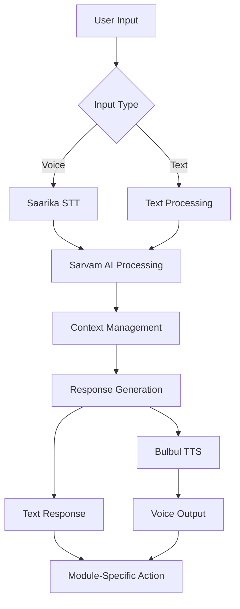

# AssistantPro Technical Architecture
## SaaS-Ready AI Platform for Emerging Markets

**Version**: 2.0  
**Last Updated**: June 4, 2025  
**Architecture Type**: Microservices with AI-First Design  
**Deployment Target**: Multi-tenant SaaS platform

---

## 🏗️ **System Architecture Overview**

### **High-Level Architecture Pattern**

```
┌─────────────────────────────────────────────────────────────┐
│                    API Gateway Layer                        │
│                  (Rate Limiting, Auth)                      │
└─────────────────────┬───────────────────────────────────────┘
                      │
┌─────────────────────┴───────────────────────────────────────┐
│                  AI Orchestration Layer                     │
│               (Soch - Core AI Platform)                     │
│    ┌──────────────┬──────────────┬──────────────────────┐   │
│    │ Voice        │              │                      │   │
│    │ Processing   │ Emotional    │ Cultural Context     │   │
│    │ (Sarvam AI   │ Inteligence  │ Management           │   │
│    │ Integration) │              │                      │   │
│    └──────────────┴──────────────┴──────────────────────┘   │
└─────────────────────┬───────────────────────────────────────┘
                      │
┌─────────────────────┴───────────────────────────────────────┐
│                 Application Services Layer                  │
│  ┌─────────────┐  ┌─────────────┐  ┌─────────────────────┐  │
│  │   Mudra     │  │   Sikshak   │  │   Tenant Mgmt       │  │
│  │ (Finance)   │  │ (Education) │  │   Service           │  │
│  └─────────────┘  └─────────────┘  └─────────────────────┘  │
└─────────────────────┬───────────────────────────────────────┘
                      │
┌─────────────────────┴───────────────────────────────────────┐
│                    Data Layer                               │
│  ┌─────────────┐  ┌─────────────┐  ┌─────────────────────┐  │
│  │ PostgreSQL  │  │   Redis     │  │   Local Storage     │  │
│  │ (Multi-     │  │  (Cache)    │  │  (Mobile Devices)   │  │
│  │ Tenant)     │  │             │  │                     │  │
│  └─────────────┘  └─────────────┘  └─────────────────────┘  │
└─────────────────────────────────────────────────────────────┘
```

## 🎯 **SaaS Architecture Principles**

### **Multi-Tenancy Design**

**Tenant Isolation Strategy**: Shared Database, Isolated Schemas

```sql
-- Tenant isolation at database level
CREATE SCHEMA tenant_123456;
CREATE SCHEMA tenant_789012;

-- All tables prefixed with tenant context
CREATE TABLE tenant_123456.user_conversations (...);
CREATE TABLE tenant_123456.financial_transactions (...);
```

**Benefits**:
- **Cost Efficiency**: Shared infrastructure resources
- **Scalability**: Easy horizontal scaling
- **Maintenance**: Single codebase for all tenants
- **Compliance**: Tenant data isolation for privacy

### **API-First Design**

**RESTful API Architecture**:
```
/api/v1/tenants/{tenantId}/
├── /ai/chat                    # Soch AI interactions
├── /finance/transactions       # Mudra financial data
├── /education/sessions         # Sikshak learning data
├── /users/profiles             # User management
└── /analytics/insights         # Usage analytics
```

**GraphQL Layer** (Phase 2):
- Unified data access across all modules
- Tenant-aware query resolution
- Real-time subscriptions for AI interactions

## 🤖 **AI Platform Architecture (Soch Core)**

### **Unified AI Processing Pipeline**



### **Cross-Module Intelligence**

**Shared Context Architecture**:
```typescript
interface AIContext {
  tenantId: string;
  userId: string;
  conversationHistory: Message[];
  culturalProfile: CulturalContext;
  financialContext?: MudraContext;
  educationalContext?: SikshakContext;
  preferences: UserPreferences;
}
```

**Benefits**:
- **Contextual Continuity**: AI remembers across modules
- **Cultural Consistency**: Same cultural intelligence everywhere
- **Resource Efficiency**: Single AI engine for all features

## 💰 **Module Architecture**

### **Mudra (Finance) - Microservice Design**

```
┌─────────────────────────────────────────────────────────────┐
│                  Mudra Finance Service                      │
│                                                             │
│  ┌─────────────┐  ┌─────────────┐  ┌─────────────────────┐  │
│  │ SMS Parser  │  │ Transaction │  │ Analytics Engine    │  │
│  │ Engine      │  │ Categorizer │  │                     │  │
│  └─────────────┘  └─────────────┘  └─────────────────────┘  │
│          │                │                    │            │
│  ┌─────────────┐  ┌─────────────┐  ┌─────────────────────┐  │
│  │             │  │ Data        │  │ Export Service      │  │
│  │             │  │ Encryption  │  │                     │  │
│  │ Access SMS/ │  │             │  │                     │  │
│  │ Email for   │  │             │  │                     │  │
│  │ Scanning UP │  │             │  │                     │  │
│  │Transactions │  │             │  │                     │  │
│  └─────────────┘  └─────────────┘  └─────────────────────┘  │
└─────────────────────────────────────────────────────────────┘
```

**Key Features**:
- **Offline-First**: Core functionality without internet
- **Privacy-First**: Local data encryption
- **UPI Native**: Deep integration with Indian payment systems
- **Multi-Language**: Hinglish SMS parsing

### **Sikshak (Education) - Adaptive Learning**

```
```
┌─────────────────────────────────────────────────────────────┐
│                Sikshak Education Service                    │
│                                                             │
│  ┌─────────────┐  ┌─────────────┐  ┌─────────────────────┐  │
│  │ Learning    │  │ Cultural    │  │ Habitual Progress   │  │
│  │ Engine      │  │ Adaptation  │  │    Tracking         │  │
│  └─────────────┘  └─────────────┘  └─────────────────────┘  │
│          │                │                    │            │
│  ┌─────────────┐  ┌─────────────┐  ┌─────────────────────┐  │
│  │ Financial   │  │ Assessment  │  │ Parent Dashboard    │  │
│  │ Context     │  │ Engine      │  │                     │  │
│  └─────────────┘  └─────────────┘  └─────────────────────┘  │
│                                                             │
│  ┌─────────────────────────────────────────────────────┐    │
│  │            Content Partnership Module               │    │
│  │  ┌─────────────────────┐  ┌─────────────────────┐   │    │
│  │  │ Destination-Based   │  │ Collaborative       │   │    │
│  │  │ Learning Platform   │  │ Content Creation    │   │    │
│  │  │                     │  │ (Trustworthy        │   │    │
│  │  │                     │  │ YouTubers - Indian/ │   │    │
│  │  │                     │  │ International)      │   │    │
│  │  └─────────────────────┘  └─────────────────────┘   │    │
│  │              │                        │             │    │
│  │              └────────────────────────┘             │    │
│  │                                                     │    │
│  └─────────────────────────────────────────────────────┘    │
└─────────────────────────────────────────────────────────────┘
```

## 🛠️ **Technology Stack**

### **Backend Services**

| Component | Technology | Justification |
|-----------|------------|---------------|
| **API Gateway** | Kong/AWS API Gateway | Rate limiting, authentication, routing |
| **Core Services** | Node.js + Express | JavaScript ecosystem, rapid development |
| **AI Processing** | Python + FastAPI | AI/ML library ecosystem |
| **Database** | PostgreSQL | ACID compliance, JSON support, multi-tenancy |
| **Cache** | Redis | Session management, API caching |
| **Message Queue** | RabbitMQ | Async processing, reliability |

### **Frontend/Mobile**

| Component | Technology | Justification |
|-----------|------------|---------------|
| **Mobile App** | React Native | Cross-platform, single codebase |
| **UI Framework** | NativeBase | Indian design patterns |
| **State Management** | Redux Toolkit | Predictable state management |
| **Offline Storage** | SQLite | Local data persistence |
| **Encryption** | React Native Keychain | Secure local storage |

### **AI/ML Stack**

| Component | Technology | Justification |
|-----------|------------|---------------|
| **Primary AI** | Sarvam AI | Indian language specialization |
| **Local Models** | TensorFlow Lite | Offline processing capability |
| **Voice Processing** | Whisper.cpp | Local speech processing |
| **Vector Database** | Chroma | Semantic search, embeddings |

## 🚀 **Deployment Architecture**

### **Container Strategy**

```yaml
# docker-compose.production.yml
services:
  api-gateway:
    image: kong:latest
    ports: ["80:8000", "443:8443"]
    
  soch-ai-service:
    image: assistantpro/soch:latest
    environment:
      - SARVAM_AI_KEY=${SARVAM_AI_KEY}
      - REDIS_URL=${REDIS_URL}
    
  mudra-service:
    image: assistantpro/mudra:latest
    environment:
      - DATABASE_URL=${DATABASE_URL}
      - ENCRYPTION_KEY=${ENCRYPTION_KEY}
    
  sikshak-service:
    image: assistantpro/sikshak:latest
    
  postgres:
    image: postgres:15
    environment:
      - POSTGRES_DB=assistantpro
      - POSTGRES_USER=${DB_USER}
      - POSTGRES_PASSWORD=${DB_PASSWORD}
    
  redis:
    image: redis:7-alpine
```

### **Kubernetes Deployment** (Phase 2)

```yaml
apiVersion: apps/v1
kind: Deployment
metadata:
  name: soch-ai-deployment
spec:
  replicas: 3
  selector:
    matchLabels:
      app: soch-ai
  template:
    metadata:
      labels:
        app: soch-ai
    spec:
      containers:
      - name: soch-ai
        image: assistantpro/soch:latest
        ports:
        - containerPort: 3000
        env:
        - name: SARVAM_AI_KEY
          valueFrom:
            secretKeyRef:
              name: ai-secrets
              key: sarvam-key
```

## 🔒 **Security Architecture**

### **Multi-Layer Security**

```
┌─────────────────────────────────────────────────────────────┐
│                 Security Layer 1: Edge                      │
│              (DDoS Protection, WAF)                         │
└─────────────────────┬───────────────────────────────────────┘
                      │
┌─────────────────────┴───────────────────────────────────────┐
│                Security Layer 2: API Gateway                │
│           (Authentication, Rate Limiting)                   │
└─────────────────────┬───────────────────────────────────────┘
                      │
┌─────────────────────┴───────────────────────────────────────┐
│               Security Layer 3: Application                 │
│            (Authorization, Input Validation)                │
└─────────────────────┬───────────────────────────────────────┘
                      │
┌─────────────────────┴───────────────────────────────────────┐
│                Security Layer 4: Data                       │
│         (Encryption at Rest, Tenant Isolation)              │
└─────────────────────────────────────────────────────────────┘
```

### **Privacy-First Implementation**

**Data Classification**:
```typescript
enum DataClassification {
  PUBLIC = "public",           // Marketing content
  INTERNAL = "internal",       // Business logic
  CONFIDENTIAL = "confidential", // User preferences
  RESTRICTED = "restricted"    // Financial data, conversations
}

interface DataHandling {
  classification: DataClassification;
  encryptionRequired: boolean;
  localStorageOnly: boolean;
  retentionPeriod: number;
  auditRequired: boolean;
}
```

## 📊 **Scalability Strategy**

### **Horizontal Scaling Plan**

**Phase 1: Single Region (India)**
- Load balancer with 3 application servers
- Database read replicas
- Redis cluster for caching

**Phase 2: Multi-Region (Asia)**
- CDN for static content
- Regional database replicas
- Cross-region AI model caching

**Phase 3: Global Scale**
- Multi-cloud deployment (AWS + Azure)
- Edge computing for AI processing
- Global data distribution with privacy compliance

### **Performance Targets**

| Metric | Target | Monitoring |
|--------|--------|------------|
| **API Response Time** | <200ms | Prometheus + Grafana |
| **AI Processing** | <2s | Custom AI metrics |
| **Mobile App Load** | <3s | React Native Performance |
| **Uptime** | 99.9% | AWS CloudWatch |
| **Concurrent Users** | 10K+ | Load testing |

## 🔧 **Integration Architecture**

### **External API Management**

```typescript
interface APIIntegration {
  provider: "sarvam" | "zerodha" | "upi-gateway";
  authentication: AuthMethod;
  rateLimiting: RateLimit;
  fallbackStrategy: FallbackOption;
  monitoring: HealthCheck;
}

class SarvamAIIntegration implements APIIntegration {
  async processVoiceInput(audio: Buffer): Promise<TextResponse> {
    // Retry logic, circuit breaker, monitoring
  }
}
```

### **Webhook Architecture**

```
External Service → API Gateway → Webhook Router → Service Handler
                                      ↓
                               Queue for Processing
                                      ↓
                               Tenant-Specific Handler
```

## 🎯 **Future Architecture Considerations**

### **Phase 2 Enhancements**

1. **Event-Driven Architecture**
   - Apache Kafka for real-time events
   - CQRS pattern for read/write separation
   - Event sourcing for audit trails

2. **AI Model Management**
   - MLflow for model versioning
   - A/B testing for AI responses
   - Federated learning for privacy

3. **Advanced Analytics**
   - Real-time dashboards
   - Predictive analytics
   - User behavior tracking

### **Global Expansion Architecture**

1. **Compliance Framework**
   - GDPR compliance module
   - Data residency management
   - Audit trail system

2. **Localization Engine**
   - Dynamic language loading
   - Cultural adaptation framework
   - Regional AI model deployment

---

**Next Steps**: See [Implementation Guide](../03-IMPLEMENTATION/development-setup.md) for practical development setup.
