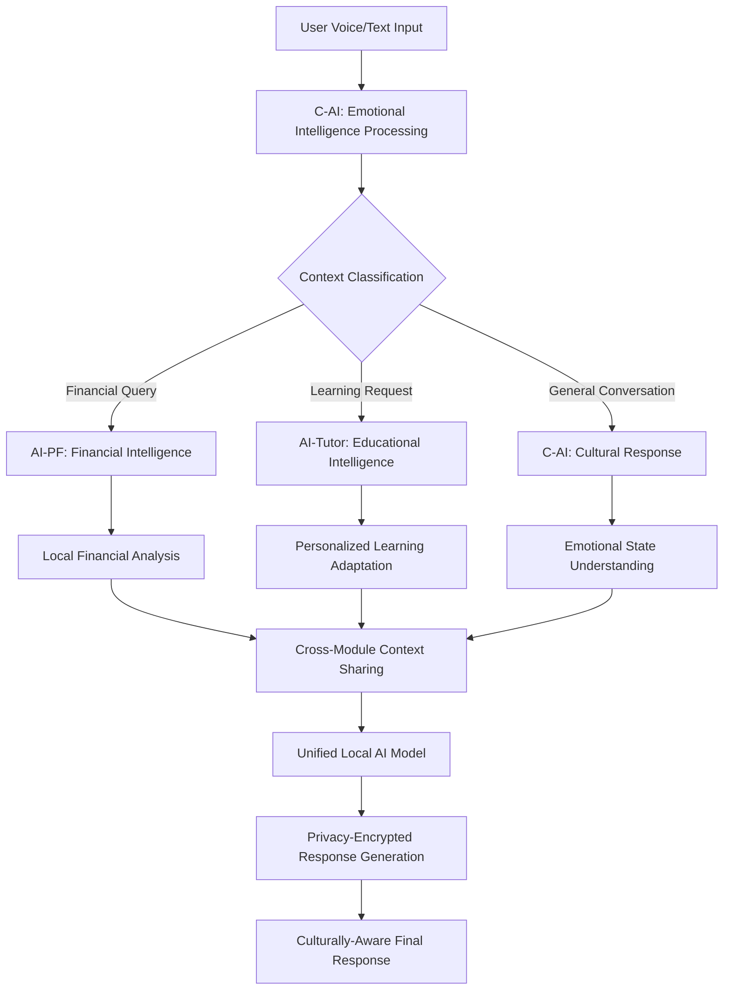

# AI Personal Assistant (MVP_PA) - Complete Project Overview

## 🎯 Project Summary

**AssistantPro** is a revolutionary privacy-first, mobile-first AI personal assistant specifically engineered for the Indian market. This comprehensive platform seamlessly integrates three core AI modules: **AI Personal Finance (AI-PF)**, **AI Educational Tutor (AI-Tutor)**, and **Conversational AI with Emotional Intelligence (C-AI)** - all while maintaining complete user data sovereignty through local encryption and on-device AI processing.

### 🔍 Core Vision & Innovation
Building upon 's vision for AI personal assistants and tutors, AssistantPro represents the convergence of three critical trends:
- **Privacy-First AI Architecture**: Complete data sovereignty with local processing
- **Cultural Intelligence**: Deep understanding of Indian communication patterns and cultural nuances
- **Hybrid Mobile-Web Architecture**: Native app shell rendering intelligent web interfaces

### 🏆 Key Differentiators
- **Complete Privacy**: All personal data processed and stored locally with encryption
- **India-First Design**: Deep UPI integration, Hindi/English support, regional cultural awareness
- **Offline Functionality**: Core features work without internet connectivity through SMS scanning
- **Emotional Intelligence**: Culturally-aware AI that understands Indian communication patterns and family dynamics
- **Comprehensive Device Integration**: Full access to device capabilities for maximum contextual intelligence
- **Triple AI Integration**: Financial + Educational + Conversational AI in one privacy-first platform

---

## 🧭 Strategic Context & Market Positioning

This project directly addresses three  Requests for Startups:

1. **AI Personal Assistant** (Tom Blomfield): Moving from "to-do" to "done" lists with deep personal understanding
2. **AI Personal Tutor** (Harj Taggar): Personalized learning experiences for everyone using multimodal AI
3. **Voice AI** (Gustaf Alströmer): Revolutionary voice interactions replacing traditional phone systems

### Market Innovation Gap
While global AI assistants focus on cloud processing and Western markets, AssistantPro uniquely combines:
- **Privacy-first local processing** vs. cloud-dependent competitors
- **Indian cultural intelligence** vs. generic Western-focused AI responses
- **Integrated financial + educational + conversational AI** vs. single-purpose solutions

---

## 📁 Complete File/Folder Structure

```
MVP_PA/
├── 📋 Core Documentation/
│   ├── AI-PF.md                    # AI Personal Finance feature specification
│   ├── AI-Tutor.md                 # AI Educational tutor feature specification  
│   ├── APP_BRAINSTORM.md           # Comprehensive app architecture and brainstorming
│   ├── APP_BRAINSTORM_TABLES.md    # Structured tables for features and planning
│   ├── Idea-refer.md               # Reference ideas from 
│   └── README.md                   # This complete project overview
│
├── 🤖 Conversational AI/           # Emotional intelligence AI module
│   ├── C-AI.md                     # Conversational AI with emotional intelligence specs
│   ├── Sarvam-usage-pricing.png    # Sarvam AI implementation reference
│   ├── API-references/             # Complete Sarvam AI API documentation
│   │   ├── POST-Chat-Completions.md    # Chat completion API reference
│   │   ├── POST-TTS.md                 # Text-to-speech API reference
│   │   ├── Speech-to-text/             # Speech recognition APIs
│   │   │   ├── POST-STT.md             # Basic speech-to-text API
│   │   │   └── POST-STT-Translate.md   # Speech-to-text with translation
│   │   ├── Text/                       # Text processing APIs
│   │   │   ├── POST-Lang-Identificaton.md  # Language identification API
│   │   │   ├── POST-Translate-Text.md      # Text translation API
│   │   │   └── POST-transliterate-text.md  # Text transliteration API
│   │   └── PDFs/                       # Additional API documentation
│   │       ├── doc-translate.md        # Document translation reference
│   │       └── Sarvam-parse.md         # Sarvam parsing utilities
│   ├── ASR/                        # Automatic Speech Recognition documentation
│   │   ├── STT-Quickstart-Guide.md    # Quick start guide for speech-to-text
│   │   ├── APIs/                       # ASR API specifications
│   │   │   ├── Overview.md             # ASR APIs overview
│   │   │   ├── Real-time-STT-API.md    # Real-time speech recognition
│   │   │   └── Batch-STT-API.md        # Batch speech processing
│   │   └── Models/                     # ASR model specifications
│   │       ├── Saarika.md              # Saarika speech recognition model
│   │       └── Saaras.md               # Saaras speech translation model
│   ├── Text-Processing/            # Text processing and language APIs
│   │   ├── Quickstart.md               # Text processing quick start
│   │   ├── APIs/                       # Text processing API documentation
│   │   │   ├── lang-detection-API.md   # Language detection API
│   │   │   ├── Text-Translation-API.md # Text translation API details
│   │   │   └── Transliteration-API.md  # Transliteration API details
│   │   └── Models/                     # Text processing models
│   │       └── Mayura/                 # Mayura text processing model
│   ├── Text-To-Speech/             # Text-to-speech synthesis documentation
│   │   ├── Quickstart.md               # TTS quick start guide
│   │   ├── APIs/                       # TTS API specifications
│   │   │   └── Overview.md             # TTS APIs overview
│   │   └── Models/                     # TTS model specifications
│   │       └── Bulbul.md               # Bulbul text-to-speech model
│   ├── Getting-started/            # Sarvam AI setup and authentication
│   │   ├── Introduction.md             # Sarvam AI platform introduction
│   │   ├── Auth.md                     # Authentication and API keys
│   │   ├── Quickstart.md               # Developer quick start guide
│   │   ├── Models.md                   # Available models overview
│   │   ├── Credits-&-Rate-Limits.md    # Usage limits and billing
│   │   └── Meta Prompt Guide.md        # Meta-prompting best practices
│   └── Starter-Notebooks(Cookbook)/   # Implementation examples and tutorials
│       ├── Chat-Completion-API-Using-Sarvam-Model.md      # Chat API tutorial
│       ├── STT-API-Tutorial-Using-Saarika-Model.md        # Speech-to-text tutorial
│       ├── Speech-to-Text-Translation-API-Using-Saaras-Model.md  # STT translation tutorial
│       ├── Text-to-Speech-Conversion-using-Bulbul-Model.md # TTS tutorial
│       ├── Sarvam-Translate-API-using-Mayura-Model.md     # Translation tutorial
│       ├── Language-Identification-API-A-Hands-on-Guide.md # Language detection tutorial
│       └── Transliteration-API-A-Hands-on-Guide.md        # Transliteration tutorial
│
├── 🖼️ AIF reference/               # AI Finance UI/UX reference materials
│   ├── 1.second-view.jpg           # Secondary view interface
│   ├── 2.home-view.jpg             # Main dashboard interface
│   ├── 2.Transaction-categories-view.jpg  # Transaction categorization UI
│   ├── 2.Transaction-menu-options.jpg     # Transaction action menu
│   ├── 2.Transaction-view.jpg             # Individual transaction view
│   ├── 3.categories-view.jpg             # Expense categories overview
│   ├── 3.category-wise-transaction-list-view.jpg  # Category-filtered transactions
│   ├── 3.filter-view-aside.jpg          # Transaction filtering sidebar
│   ├── 3.merchant-view.jpg              # Merchant-specific view
│   ├── 3.merchant-vise-transactions-list-view.jpg  # Merchant transaction history
│   ├── 3.month-dropdown-slider.jpg      # Date range selector
│   ├── 3.transactions-list-view.jpg     # Main transaction list
│   ├── 4.trends-view-aside-filter.jpg   # Analytics filtering
│   ├── 4.trends-view.jpg                # Financial trends and analytics
│   └── axio_expense_report_7600925494_1748442917321533.pdf  # Sample expense report
│
├── 📊 How-to-think-about-AI-Applications/  # AI application strategy resources
│   ├── SS1.png                     # AI application strategy screenshot 1
│   └── SS2.png                     # AI application strategy screenshot 2
│
└── .git/                           # Git version control
```

---

## 📋 File/Folder Descriptions

### 📋 Core Documentation

#### **AI-PF.md** - AI Personal Finance Module
- **Purpose**: Complete specification for AI-powered financial management
- **Key Features**: 
  - Automatic transaction detection from SMS/email
  - UPI integration and GST compliance for Indian market
  - Offline-first design with SMS scanning
  - Intelligent expense categorization and merchant analysis
  - Financial trends visualization and reporting
- **Target**: India-first design with multi-language support

#### **AI-Tutor.md** - AI Educational Assistant  
- **Purpose**: Personalized learning system specification
- **Subjects**: History (Indian focus), Science, Mathematics, Personal Development, Financial Literacy, Arts
- **Demographics**: 
  - Children (9-12): Foundational skills, creativity, personality development
  - Teens (13-19): Collaborative learning, communication skills
  - Adults (20+): Professional development, workplace skills
- **Approach**: Real-life examples, interactive learning, culturally-sensitive content

#### **Conversational AI/** - Emotional Intelligence Module
- **C-AI.md**: Complete specification for culturally-aware conversational AI
- **Key Features**:
  - Regional communication adaptation (North, South, East, West India)
  - Emotional recognition and culturally appropriate responses
  - Festival awareness and cultural context understanding
  - Voice tone analysis for stress/excitement detection
  - Complete local processing for privacy using Sarvam AI technology
- **Implementation**: Sarvam-M (24B parameter model) with Saarika ASR and Bulbul TTS APIs
- **Development**: 5-phase roadmap from basic responses to advanced emotional AI
- **Sarvam-usage-pricing.png**: Implementation cost reference for Sarvam AI services

##### **API-references/** - Complete Sarvam AI API Documentation
- **Speech-to-text/**: Core speech recognition APIs
  - **POST-STT.md**: Real-time speech-to-text API using Saarika model
  - **POST-STT-Translate.md**: Speech-to-text with translation using Saaras model
- **Text/**: Text processing and language APIs
  - **POST-Lang-Identificaton.md**: Language and script identification API
  - **POST-Translate-Text.md**: Text translation between Indian languages
  - **POST-transliterate-text.md**: Script conversion and transliteration
- **POST-Chat-Completions.md**: Chat completion API using Sarvam-M model
- **POST-TTS.md**: Text-to-speech API using Bulbul model
- **PDFs/**: Additional documentation for document processing and parsing

##### **ASR/** - Automatic Speech Recognition Documentation
- **STT-Quickstart-Guide.md**: Quick start guide for implementing speech recognition
- **APIs/**: Detailed API specifications
  - **Overview.md**: Complete overview of ASR APIs and capabilities
  - **Real-time-STT-API.md**: Synchronous speech processing for quick transcriptions
  - **Batch-STT-API.md**: Asynchronous processing for large audio files
- **Models/**: Speech recognition model specifications
  - **Saarika.md**: High-accuracy speech recognition for Indian languages with multi-speaker support
  - **Saaras.md**: Domain-optimized speech translation with telephony support

##### **Text-Processing/** - Language Processing APIs
- **Quickstart.md**: Getting started with text processing capabilities
- **APIs/**: Comprehensive text processing API documentation
  - **lang-detection-API.md**: Automatic language and script identification
  - **Text-Translation-API.md**: Advanced translation with formal/colloquial modes
  - **Transliteration-API.md**: Script conversion with romanization support
- **Models/Mayura/**: Advanced text processing model for Indian languages

##### **Text-To-Speech/** - Speech Synthesis Documentation
- **Quickstart.md**: Quick start guide for text-to-speech implementation
- **APIs/Overview.md**: Complete TTS API specifications and capabilities
- **Models/Bulbul.md**: High-quality multilingual TTS with natural prosody and emotion control

##### **Getting-started/** - Platform Setup and Authentication
- **Introduction.md**: Comprehensive introduction to Sarvam AI platform
- **Auth.md**: API key management and authentication procedures
- **Quickstart.md**: Step-by-step developer onboarding guide
- **Models.md**: Overview of all available Sarvam AI models (Sarvam-M, Saarika, Saaras, Bulbul, Mayura)
- **Credits-&-Rate-Limits.md**: Usage billing, credit system, and rate limiting details
- **Meta Prompt Guide.md**: Best practices for prompting and AI interaction design

##### **Starter-Notebooks(Cookbook)/** - Implementation Tutorials
- **Chat-Completion-API-Using-Sarvam-Model.md**: Complete tutorial for implementing chat functionality
- **STT-API-Tutorial-Using-Saarika-Model.md**: Speech-to-text implementation guide with code examples
- **Speech-to-Text-Translation-API-Using-Saaras-Model.md**: Combined speech recognition and translation tutorial
- **Text-to-Speech-Conversion-using-Bulbul-Model.md**: TTS implementation with audio file generation
- **Sarvam-Translate-API-using-Mayura-Model.md**: Text translation implementation with multiple language support
- **Language-Identification-API-A-Hands-on-Guide.md**: Automatic language detection implementation
- **Transliteration-API-A-Hands-on-Guide.md**: Script conversion and romanization tutorial

#### **APP_BRAINSTORM.md** - Comprehensive App Architecture
- **Purpose**: Complete technical and strategic planning document
- **Sections**:
  - Privacy-first architecture with local AI processing
  - Comprehensive device permissions strategy
  - Technical stack comparison (React Native vs Flutter vs Native)
  - Development phases and timeline (5 phases, 30+ weeks)
  - Voice processing strategy and regional language support
  - Business model and competitive positioning

#### **APP_BRAINSTORM_TABLES.md** - Structured Planning Tables
- **Purpose**: Organized tables for development planning and feature comparison
- **Content**:
  - Executive summary and privacy architecture overview
  - Technical architecture comparison across frameworks
  - Device permissions matrix with privacy protections
  - Development phases timeline with metrics
  - Voice processing evolution roadmap
  - Emotional intelligence development phases

#### **Idea-refer.md** -  Reference Ideas
- **Purpose**: Reference inspiration from  startup ideas
- **Topics**: Voice AI, AI Personal Assistant, AI Personal Tutor, Future of Education
- **Value**: Strategic direction and market validation for similar concepts

### 🖼️ UI/UX Reference Materials

#### **AIF reference/** - AI Finance Interface References
- **Purpose**: Visual design references for the financial management module
- **Content**: 14 UI screenshots showing complete user flow
- **Features Demonstrated**:
  - Transaction list and categorization interfaces
  - Merchant-based transaction filtering
  - Financial trends and analytics dashboards
  - Category management and filtering options
  - Date range selection and reporting tools
- **Value**: Provides concrete UI patterns for implementation

#### **How-to-think-about-AI-Applications/** - Strategy Resources
- **Purpose**: Strategic thinking resources for AI application development
- **Content**: Screenshots of AI application development methodologies
- **Value**: Guidance on AI product strategy and implementation approaches

---

## 🏗️ Main Features/Modules

### 1. 🏦 **AI Personal Finance (AI-PF)**
**Status**: High Priority, In Development
- **SMS/Email Transaction Scanning**: Automatic detection and categorization
- **UPI Integration**: Native support for Indian digital payments
- **GST Compliance**: Automatic tax calculation and business expense tracking
- **Offline-First**: Core functionality via SMS scanning, enhanced by email when online
- **Multi-language**: Hindi/English support with regional adaptation
- **Privacy**: All financial data encrypted locally, never shared

### 2. 🎓 **AI Personal Tutor (AI-Tutor)**  
**Status**: Medium Priority, Design Phase
- **Personalized Learning**: Adaptive content based on age, learning style, and progress
- **Indian Cultural Focus**: Emphasis on Indian history, arts, and cultural values
- **Multi-demographic Support**: Specialized content for children, teens, and adults
- **Interactive Tools**: Bite-sized quizzes, progress tracking, and practical examples
- **Skill Development**: Communication, creativity, problem-solving, and professional skills

### 3. 🤖 **Conversational AI with Emotional Intelligence (C-AI)**
**Status**: High Priority, Implementation Phase  
- **Cultural Awareness**: Deep understanding of Indian communication patterns
- **Regional Adaptation**: Communication styles for different Indian regions (North, South, East, West)
- **Emotional Recognition**: Voice tone analysis and contextual emotional responses
- **Festival Integration**: Culturally relevant responses during Indian festivals
- **Privacy-First EI**: All emotional learning processed and stored locally
- **Comprehensive Sarvam AI Implementation**: 
  - **Sarvam-M (24B parameters)** for text processing and reasoning
  - **Saarika ASR** for speech-to-text in 11 Indian languages with multi-speaker support
  - **Saaras ASR** for domain-optimized speech translation with telephony support
  - **Bulbul TTS** for natural-sounding Indian language text-to-speech with emotion control
  - **Mayura** for advanced text processing including translation and transliteration
  - **Speech-to-Speech Pipeline**: Saarika/Saaras → Sarvam-M → Bulbul for complete voice interaction
- **Complete API Documentation**: Ready-to-implement guides for all Sarvam AI services
- **Implementation Resources**: 
  - Detailed API references for all speech and text processing capabilities
  - Step-by-step tutorials and cookbooks for each service
  - Authentication and billing setup guides
  - Real-time and batch processing options
- **Development Timeline**: 5 phases from basic polite responses to personalized emotional AI companion

### 4. 🔐 **Privacy-First Architecture**
**Status**: Core Requirement, Foundational
- **Local AI Processing**: All personal data analysis happens on-device
- **Hardware Encryption**: AES-256 with device security modules
- **Zero-Knowledge Cloud**: Only anonymous operational metrics sent to cloud
- **Comprehensive Device Access**: Full integration with maximum privacy protection

### 5. 🗣️ **Voice Processing System**
**Status**: Medium Priority, 4-Phase Development
- **Phase 1-2**: Cloud APIs with privacy protection (0-18 months)
- **Phase 3**: Hybrid local/cloud processing (18-30 months)  
- **Phase 4**: Complete local voice processing (30+ months)
- **Regional Languages**: Specialized models for Hindi, Tamil, Telugu, Bengali, etc.

---

## 🎯 Key Technical Components

### **Mobile-First Hybrid Architecture**
- **Framework Options**: React Native (recommended), Flutter, or Native development
- **Local AI Stack**: Llama.cpp, ONNX Runtime, TensorFlow Lite
- **Encryption**: Device-native keychain/keystore with AES-256
- **Voice Processing**: Google/Microsoft APIs → Custom regional models → Local-only
- **Storage**: Encrypted local databases (SQLite, Chroma vector DB)

### **Privacy-Preserving Data Flow**
```
User Input → Local Processing → Encrypted Storage → Local AI → Actions
                                       ↓
            Anonymous Metrics Only → Cloud Analytics → System Improvements
```

### **Device Integration Strategy**
- **Communication**: Email, SMS, contacts, call logs
- **Calendar**: Events, scheduling, conflict resolution
- **Location**: GPS, movement patterns, contextual reminders
- **Media**: Camera, photos, document scanning
- **Health**: Wellness data for energy-based scheduling

---

## 📊 Development Roadmap

### **Phase 1: MVP Core Assistant** (6-8 weeks)
**Current Focus: Foundation & Core Permissions**
- ✅ Basic AI chat interface and voice commands
- ✅ Email/calendar integration (read-only)  
- ✅ Core device permissions with privacy protection
- ✅ Simple financial transaction detection
- 🔄 **Sarvam AI Integration**: Basic Sarvam-M text processing setup
- 🔄 **C-AI Phase 1**: Basic polite responses and Indian greetings

**Key Deliverables:**
- Working AI chat interface on both platforms
- Basic email and calendar integration
- Voice command proof of concept
- Simple task creation and management
- Core device permissions with privacy protection

**Success Metrics:**
- App loads in <3 seconds
- Voice recognition accuracy >85%
- Basic AI responses within 2 seconds
- Permission acceptance rate >80% for core permissions

### **Phase 2: Smart Features** (8-10 weeks)  
**Focus: Intelligence & Regional Adaptation**
- 🔄 Advanced email processing and smart scheduling
- 🔄 Enhanced financial categorization and UPI integration
- 🔄 User pattern learning and preference adaptation
- 🔄 **Sarvam AI Enhancement**: Saarika ASR integration for Indian languages
- 🔄 **C-AI Phase 2**: Sentiment recognition and cultural awareness (festivals)
- 📋 Extended permissions: Location, Camera, Photo Library, File System
- 📋 Cross-app integration and smart automation
- 📋 Contextual intelligence with location and activity-based suggestions

**Key Deliverables:**
- Intelligent email management
- Proactive scheduling suggestions
- User behavior learning system  
- Third-party integrations (Google Workspace, Office 365)
- Comprehensive device integration features

**Success Metrics:**
- Email processing accuracy >90%
- User engagement >3 sessions/day
- Task automation success rate >80%
- Device integration usage >60% of users enable extended permissions
- Cross-app workflow adoption >40% of users use workflow automation

### **Phase 3: Advanced Intelligence** (6-8 weeks)
**Focus: Cultural Intelligence & Local Processing**
- 📋 Predictive task suggestions and personal memory
- 📋 **Sarvam AI Full Pipeline**: Complete Saarika → Sarvam-M → Bulbul integration
- 📋 **C-AI Phase 3**: Regional emotional adaptation, family context understanding
- 📋 Advanced natural language processing with cultural context
- 📋 Custom workflow automation
- 📋 Team collaboration features
- 📋 Advanced voice assistant capabilities

**Key Deliverables:**
- Sophisticated AI personality with cultural awareness
- Comprehensive user analytics
- Advanced automation workflows
- Team collaboration tools
- Complete speech-to-speech pipeline in Indian languages

**Success Metrics:**
- User retention >70% at 30 days
- Average session duration >10 minutes
- Automation usage >50% of active users

### **Phase 4: Enterprise & Scale** (8-12 weeks)
**Focus: Business Features & Compliance**
- 📋 Enterprise security and team management features
- 📋 **C-AI Phase 4**: Advanced emotional support, stress recognition
- 📋 Advanced integrations (CRM, project management)
- 📋 Multi-user and team management
- 📋 API for third-party developers
- 📋 Advanced personalization
- 📋 Performance optimizations at scale

**Key Deliverables:**
- Enterprise-ready version
- Developer API and documentation
- Advanced security features
- Scalable infrastructure

### **Phase 5: AI Enhancement & Optimization** (Ongoing)
**Focus: Personalized Companion & Global Expansion**
- 📋 **C-AI Phase 5**: Personalized emotional AI companion
- 📋 Complete local voice processing (100% offline)
- 📋 Continuous AI model improvements
- 📋 A/B testing for AI responses
- 📋 Advanced machine learning features
- 📋 Predictive analytics
- 📋 Global localization and language support

**Success Metrics:**
- 100% local processing for core features
- Global market expansion readiness
- Advanced personalization effectiveness

---

## 🏆 Success Metrics & Goals

### **Technical KPIs**
- **App Performance**: <2s load time, <1s WebView rendering
- **Voice Recognition**: >90% accuracy local processing
- **Privacy**: 100% personal data stays on device
- **Offline**: Complete functionality without internet

### **User Experience Goals**
- **Permission Acceptance**: >80% for core permissions
- **Retention**: >70% at 30 days
- **Engagement**: >3 sessions/day average
- **Emotional Satisfaction**: High cultural relevance scores

### **Business Objectives**
- **Privacy Leadership**: First truly private AI assistant
- **Indian Market**: Deep cultural integration and UPI dominance
- **Enterprise Ready**: Compliance-first for regulated industries
- **Global Expansion**: Privacy-first model for international markets

---

## 🔗 Key Documentation References

- **[AI Personal Finance Specification](AI-PF.md)** - Complete financial module requirements
- **[AI Tutor Features](AI-Tutor.md)** - Educational system design and target demographics  
- **[Conversational AI Design](Conversational%20AI/C-AI.md)** - Emotional intelligence and cultural awareness specs with Sarvam AI implementation
- **[Technical Architecture](APP_BRAINSTORM.md)** - Comprehensive development planning and technical decisions
- **[Structured Planning](APP_BRAINSTORM_TABLES.md)** - Development phases, metrics, and feature comparisons
- **[UI/UX References](AIF%20reference/)** - Complete financial interface design patterns
- **[Strategic References](Idea-refer.md)** -  inspiration and market validation

## 🚀 Getting Started

This project is currently in **Phase 1 Implementation** with focus on:

### **Current Priority Tasks:**
1. **Sarvam AI Integration Setup** - Establish API connections for Sarvam-M, Saarika, and Bulbul
2. **Core Privacy Architecture** - Implement local encryption and permission management
3. **Basic C-AI Implementation** - Deploy Phase 1 emotional intelligence features
4. **Mobile App Foundation** - React Native setup with WebView integration
5. **Voice Processing Pipeline** - Initial speech-to-speech workflow using Sarvam APIs

### **Implementation Resources Available:**
- **Complete Sarvam AI Documentation**: Step-by-step guides for all services
- **Ready-to-Use API References**: Detailed documentation for every endpoint
- **Implementation Tutorials**: 7 comprehensive cookbook guides covering:
  - Chat completion using Sarvam-M
  - Speech-to-text with Saarika
  - Text-to-speech with Bulbul  
  - Language detection and translation
  - Speech translation with Saaras
  - Text transliteration workflows
- **Authentication & Billing Setup**: Complete onboarding documentation

### **Next Steps:**
1. **Technical Implementation** - Begin Phase 1 MVP development based on APP_BRAINSTORM.md roadmap
2. **Sarvam AI Partnership** - Establish developer account and API access using Getting-started/ guides
3. **Privacy Architecture Validation** - Test local processing capabilities
4. **Cultural Consultancy** - Engage Indian regional experts for C-AI cultural intelligence
5. **User Research** - Validate emotional intelligence requirements with target demographics

---

## 🔄 **Connecting the Dots - Integrated System Architecture**

### **How All Components Work Together**

This codebase represents a meticulously planned **convergence of three AI systems** into one unified privacy-first platform. Here's how each component connects and reinforces the others:

#### **📊 Cross-Module Data Flow & Intelligence Sharing**



#### **🧠 Intelligence Synergies Between Modules**

| Scenario | AI-PF Contribution | AI-Tutor Contribution | C-AI Contribution | Unified Response |
|----------|-------------------|----------------------|-------------------|------------------|
| **"I'm stressed about my spending"** | Financial analysis showing spending patterns | Educational content on budgeting skills | Emotional support with cultural sensitivity | Personalized financial education with emotional support |
| **"Teach me about compound interest"** | Real transaction data for examples | Interactive learning content | Regional communication adaptation | Personalized financial literacy using user's actual data |
| **"Happy Diwali! Help me plan expenses"** | Festival spending analysis & budgeting | Cultural education about financial traditions | Festival greetings with cultural awareness | Comprehensive Diwali financial planning with cultural context |
| **"My child needs math help"** | Family expense tracking for education costs | Age-appropriate math tutoring | Parent-child communication dynamics | Integrated educational planning with financial support |

#### **🔐 Unified Privacy Architecture**

All three modules share the same **privacy-first foundation**:

```yaml
Device-Local Processing:
  Financial Data (AI-PF): 
    - Transaction patterns, spending categories, merchant relationships
    - SMS banking alerts, UPI transaction history
    - GST calculations and business expense tracking
    
  Educational Data (AI-Tutor):
    - Learning progress, subject preferences, skill assessments
    - Cultural content adaptation, age-appropriate filtering
    - Creator content integration and progress tracking
    
  Emotional Data (C-AI):
    - Voice tone patterns, emotional state history
    - Cultural communication preferences, regional adaptations
    - Family dynamics understanding, relationship context

Cloud Processing (Anonymous Only):
  - Performance metrics without personal identifiers
  - Model improvement data without content
  - Usage patterns for system optimization
```

#### **📱 Integrated Development Strategy**

The **APP_BRAINSTORM.md** and **APP_BRAINSTORM_TABLES.md** files reveal a sophisticated **5-phase development strategy** where each module builds upon and reinforces the others:

**Phase 1 Foundation**: All three modules share voice processing, device permissions, and privacy architecture
**Phase 2 Intelligence**: Cross-module context sharing enables AI-PF financial insights to inform AI-Tutor education and C-AI emotional responses
**Phase 3 Advanced**: Unified emotional intelligence enhances both financial decision-making and educational engagement
**Phase 4 Enterprise**: Integrated privacy compliance benefits all modules for business/educational institution adoption
**Phase 5 Mastery**: Complete local AI processing creates a truly sovereign digital assistant

#### **🎯 Market Positioning Convergence**

The codebase addresses **three  startup requests simultaneously**:

1. **AI Personal Assistant** → Comprehensive device integration and task automation
2. **AI Personal Tutor** → Culturally-aware educational content delivery  
3. **Voice AI** → Revolutionary privacy-first voice processing with regional language support

#### **🖼️ UI/UX Integration Vision**

The **AIF reference/** folder provides UI patterns that extend beyond finance:
- **Transaction categorization** → **Learning topic organization** in AI-Tutor
- **Merchant relationship tracking** → **Educational creator relationships** in AI-Tutor
- **Financial trends analysis** → **Learning progress analytics** in AI-Tutor
- **Cultural spending patterns** → **Cultural learning preferences** in C-AI

#### **🚀 Competitive Advantage Through Integration**

While competitors focus on **single-purpose AI tools**, this codebase creates an **ecosystem advantage**:

- **Privacy Differentiation**: No major AI assistant offers 100% local personal data processing
- **Cultural Intelligence**: No AI has deep Indian regional emotional intelligence
- **Educational Integration**: No financial app offers integrated personalized tutoring
- **Financial Intelligence**: No educational platform has UPI-integrated financial literacy
- **Emotional Awareness**: No privacy-first AI has culturally-aware emotional intelligence

#### **📊 Success Through Synergy**

The integrated approach creates **compound user value**:
- Users trust one app with comprehensive device access rather than multiple apps
- Financial stress reduction through both AI-PF insights and C-AI emotional support
- Educational motivation through real financial examples from AI-PF in AI-Tutor
- Cultural celebration enhancement through C-AI festival awareness and AI-PF budget planning

### **🎯 Strategic Execution Path**

1. **Start with AI-PF** (highest user need, clearest value proposition)
2. **Add C-AI** (emotional intelligence amplifies financial decision-making)
3. **Integrate AI-Tutor** (educational content reinforces financial literacy and cultural values)
4. **Scale through privacy leadership** (unique positioning in increasingly privacy-conscious market)

This codebase represents not just three AI modules, but a **comprehensive digital companion strategy** that leverages privacy, cultural intelligence, and integrated AI to create unprecedented user value in the Indian market with global expansion potential.

---

*AssistantPro: Where Financial Intelligence, Educational Wisdom, and Emotional Understanding converge in complete privacy to create India's first truly intelligent digital companion.*