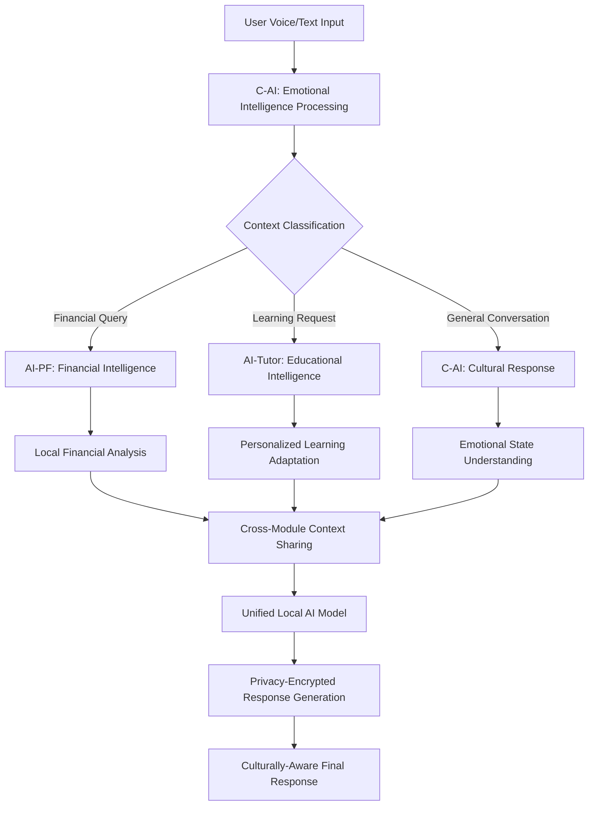

# AI Personal Assistant (MVP_PA) - Complete Project Overview

## 🎯 Project Summary

**AssistantPro** is a revolutionary privacy-first, mobile-first AI personal assistant specifically engineered for the Indian market. This comprehensive platform seamlessly integrates three core AI modules: **AI Personal Finance (AI-PF)**, **AI Educational Tutor (AI-Tutor)**, and **Conversational AI with Emotional Intelligence (C-AI)** - all while maintaining complete user data sovereignty through local encryption and on-device AI processing.

### 🔍 Core Vision & Innovation
Building upon Y Combinator's vision for AI personal assistants and tutors, AssistantPro represents the convergence of three critical trends:
- **Privacy-First AI Architecture**: Complete data sovereignty with local processing
- **Cultural Intelligence**: Deep understanding of Indian communication patterns and cultural nuances
- **Hybrid Mobile-Web Architecture**: Native app shell rendering intelligent web interfaces

### 🏆 Key Differentiators
- **Complete Privacy**: All personal data processed and stored locally with encryption
- **India-First Design**: Deep UPI integration, Hindi/English support, regional cultural awareness
- **Offline Functionality**: Core features work without internet connectivity through SMS scanning
- **Emotional Intelligence**: Culturally-aware AI that understands Indian communication patterns and family dynamics
- **Comprehensive Device Integration**: Full access to device capabilities for maximum contextual intelligence
- **Triple AI Integration**: Financial + Educational + Conversational AI in one privacy-first platform

---

## 🧭 Strategic Context & Market Positioning

This project directly addresses three Y Combinator Requests for Startups:

1. **AI Personal Assistant** (Tom Blomfield): Moving from "to-do" to "done" lists with deep personal understanding
2. **AI Personal Tutor** (Harj Taggar): Personalized learning experiences for everyone using multimodal AI
3. **Voice AI** (Gustaf Alströmer): Revolutionary voice interactions replacing traditional phone systems

### Market Innovation Gap
While global AI assistants focus on cloud processing and Western markets, AssistantPro uniquely combines:
- **Privacy-first local processing** vs. cloud-dependent competitors
- **Indian cultural intelligence** vs. generic Western-focused AI responses
- **Integrated financial + educational + conversational AI** vs. single-purpose solutions

---

## 📁 Complete File/Folder Structure

```
MVP_PA/
├── 📋 Documentation/
│   ├── AI-PF.md                    # AI Personal Finance feature specification
│   ├── AI-Tutor.md                 # AI Educational tutor feature specification  
│   ├── C-AI.md                     # Conversational AI with emotional intelligence
│   ├── APP_BRAINSTORM.md           # Comprehensive app architecture and brainstorming
│   ├── APP_BRAINSTORM_TABLES.md    # Structured tables for features and planning
│   ├── Idea-refer.md               # Reference ideas from Y Combinator
│   └── README.md                   # This project overview (newly created)
│
├── 🖼️ AIF reference/               # AI Finance UI/UX reference materials
│   ├── UI Screenshots/
│   │   ├── 1.second-view.jpg             # Secondary view interface
│   │   ├── 2.home-view.jpg               # Main dashboard interface
│   │   ├── 2.Transaction-categories-view.jpg  # Transaction categorization UI
│   │   ├── 2.Transaction-menu-options.jpg     # Transaction action menu
│   │   ├── 2.Transaction-view.jpg             # Individual transaction view
│   │   ├── 3.categories-view.jpg             # Expense categories overview
│   │   ├── 3.category-wise-transaction-list-view.jpg  # Category-filtered transactions
│   │   ├── 3.filter-view-aside.jpg          # Transaction filtering sidebar
│   │   ├── 3.merchant-view.jpg              # Merchant-specific view
│   │   ├── 3.merchant-vise-transactions-list-view.jpg  # Merchant transaction history
│   │   ├── 3.month-dropdown-slider.jpg      # Date range selector
│   │   ├── 3.transactions-list-view.jpg     # Main transaction list
│   │   ├── 4.trends-view-aside-filter.jpg   # Analytics filtering
│   │   └── 4.trends-view.jpg                # Financial trends and analytics
│   └── axio_expense_report_7600925494_1748442917321533.pdf  # Sample expense report
│
├── 📊 How-to-think-about-AI-Applications/  # AI application strategy resources
│   ├── SS1.png                     # AI application strategy screenshot 1
│   └── SS2.png                     # AI application strategy screenshot 2
│
└── .git/                           # Git version control
```

---

## 📋 File/Folder Descriptions

### 📋 Core Documentation

#### **AI-PF.md** - AI Personal Finance Module
- **Purpose**: Complete specification for AI-powered financial management
- **Key Features**: 
  - Automatic transaction detection from SMS/email
  - UPI integration and GST compliance for Indian market
  - Offline-first design with SMS scanning
  - Intelligent expense categorization and merchant analysis
  - Financial trends visualization and reporting
- **Target**: India-first design with multi-language support

#### **AI-Tutor.md** - AI Educational Assistant  
- **Purpose**: Personalized learning system specification
- **Subjects**: History (Indian focus), Science, Mathematics, Personal Development, Financial Literacy, Arts
- **Demographics**: 
  - Children (9-12): Foundational skills, creativity, personality development
  - Teens (13-19): Collaborative learning, communication skills
  - Adults (20+): Professional development, workplace skills
- **Approach**: Real-life examples, interactive learning, culturally-sensitive content

#### **C-AI.md** - Conversational AI with Emotional Intelligence
- **Purpose**: Culturally-aware AI conversation system for Indian users
- **Features**:
  - Regional communication adaptation (North, South, East, West India)
  - Emotional recognition and culturally appropriate responses
  - Festival awareness and cultural context understanding
  - Voice tone analysis for stress/excitement detection
  - Complete local processing for privacy
- **Development**: 5-phase roadmap from basic responses to advanced emotional AI

#### **APP_BRAINSTORM.md** - Comprehensive App Architecture
- **Purpose**: Complete technical and strategic planning document
- **Sections**:
  - Privacy-first architecture with local AI processing
  - Comprehensive device permissions strategy
  - Technical stack comparison (React Native vs Flutter vs Native)
  - Development phases and timeline (5 phases, 30+ weeks)
  - Voice processing strategy and regional language support
  - Business model and competitive positioning

#### **APP_BRAINSTORM_TABLES.md** - Structured Planning Tables
- **Purpose**: Organized tables for development planning and feature comparison
- **Content**:
  - Executive summary and privacy architecture overview
  - Technical architecture comparison across frameworks
  - Device permissions matrix with privacy protections
  - Development phases timeline with metrics
  - Voice processing evolution roadmap
  - Emotional intelligence development phases

#### **Idea-refer.md** - Y Combinator Reference Ideas
- **Purpose**: Reference inspiration from Y Combinator startup ideas
- **Topics**: Voice AI, AI Personal Assistant, AI Personal Tutor, Future of Education
- **Value**: Strategic direction and market validation for similar concepts

### 🖼️ UI/UX Reference Materials

#### **AIF reference/** - AI Finance Interface References
- **Purpose**: Visual design references for the financial management module
- **Content**: 14 UI screenshots showing complete user flow
- **Features Demonstrated**:
  - Transaction list and categorization interfaces
  - Merchant-based transaction filtering
  - Financial trends and analytics dashboards
  - Category management and filtering options
  - Date range selection and reporting tools
- **Value**: Provides concrete UI patterns for implementation

#### **How-to-think-about-AI-Applications/** - Strategy Resources
- **Purpose**: Strategic thinking resources for AI application development
- **Content**: Screenshots of AI application development methodologies
- **Value**: Guidance on AI product strategy and implementation approaches

---

## 🏗️ Main Features/Modules

### 1. 🏦 **AI Personal Finance (AI-PF)**
**Status**: High Priority, In Development
- **SMS/Email Transaction Scanning**: Automatic detection and categorization
- **UPI Integration**: Native support for Indian digital payments
- **GST Compliance**: Automatic tax calculation and business expense tracking
- **Offline-First**: Core functionality via SMS scanning, enhanced by email when online
- **Multi-language**: Hindi/English support with regional adaptation
- **Privacy**: All financial data encrypted locally, never shared

### 2. 🎓 **AI Personal Tutor (AI-Tutor)**  
**Status**: Medium Priority, Design Phase
- **Personalized Learning**: Adaptive content based on age, learning style, and progress
- **Indian Cultural Focus**: Emphasis on Indian history, arts, and cultural values
- **Multi-demographic Support**: Specialized content for children, teens, and adults
- **Interactive Tools**: Bite-sized quizzes, progress tracking, and practical examples
- **Skill Development**: Communication, creativity, problem-solving, and professional skills

### 3. 🤖 **Conversational AI with Emotional Intelligence (C-AI)**
**Status**: High Priority, In Development  
- **Cultural Awareness**: Deep understanding of Indian communication patterns
- **Regional Adaptation**: Communication styles for different Indian regions
- **Emotional Recognition**: Voice tone analysis and contextual emotional responses
- **Festival Integration**: Culturally relevant responses during Indian festivals
- **Privacy-First EI**: All emotional learning processed and stored locally

### 4. 🔐 **Privacy-First Architecture**
**Status**: Core Requirement, Foundational
- **Local AI Processing**: All personal data analysis happens on-device
- **Hardware Encryption**: AES-256 with device security modules
- **Zero-Knowledge Cloud**: Only anonymous operational metrics sent to cloud
- **Comprehensive Device Access**: Full integration with maximum privacy protection

### 5. 🗣️ **Voice Processing System**
**Status**: Medium Priority, 4-Phase Development
- **Phase 1-2**: Cloud APIs with privacy protection (0-18 months)
- **Phase 3**: Hybrid local/cloud processing (18-30 months)  
- **Phase 4**: Complete local voice processing (30+ months)
- **Regional Languages**: Specialized models for Hindi, Tamil, Telugu, Bengali, etc.

---

## 🎯 Key Technical Components

### **Mobile-First Hybrid Architecture**
- **Framework Options**: React Native (recommended), Flutter, or Native development
- **Local AI Stack**: Llama.cpp, ONNX Runtime, TensorFlow Lite
- **Encryption**: Device-native keychain/keystore with AES-256
- **Voice Processing**: Google/Microsoft APIs → Custom regional models → Local-only
- **Storage**: Encrypted local databases (SQLite, Chroma vector DB)

### **Privacy-Preserving Data Flow**
```
User Input → Local Processing → Encrypted Storage → Local AI → Actions
                                       ↓
            Anonymous Metrics Only → Cloud Analytics → System Improvements
```

### **Device Integration Strategy**
- **Communication**: Email, SMS, contacts, call logs
- **Calendar**: Events, scheduling, conflict resolution
- **Location**: GPS, movement patterns, contextual reminders
- **Media**: Camera, photos, document scanning
- **Health**: Wellness data for energy-based scheduling

---

## 📊 Development Roadmap

### **Phase 1: MVP Core Assistant** (6-8 weeks)
- Basic AI chat interface and voice commands
- Email/calendar integration (read-only)
- Core device permissions with privacy protection
- Simple financial transaction detection

### **Phase 2: Smart Features** (8-10 weeks)  
- Advanced email processing and smart scheduling
- Enhanced financial categorization and UPI integration
- User pattern learning and preference adaptation
- Regional language data collection

### **Phase 3: Advanced Intelligence** (6-8 weeks)
- Predictive task suggestions and personal memory
- Custom regional voice models (Hindi, Tamil, Telugu)
- Advanced emotional intelligence and cultural adaptation
- Comprehensive analytics and insights

### **Phase 4: Enterprise & Scale** (8-12 weeks)
- Enterprise security and team management features
- Hybrid voice processing (local + cloud backup)
- Advanced integrations and developer API
- GST compliance and business features

### **Phase 5: AI Enhancement** (Ongoing)
- Complete local voice processing (100% offline)
- Personalized emotional AI companion
- Continuous model improvements and global localization
- AI marketplace and third-party privacy-first apps

---

## 🏆 Success Metrics & Goals

### **Technical KPIs**
- **App Performance**: <2s load time, <1s WebView rendering
- **Voice Recognition**: >90% accuracy local processing
- **Privacy**: 100% personal data stays on device
- **Offline**: Complete functionality without internet

### **User Experience Goals**
- **Permission Acceptance**: >80% for core permissions
- **Retention**: >70% at 30 days
- **Engagement**: >3 sessions/day average
- **Emotional Satisfaction**: High cultural relevance scores

### **Business Objectives**
- **Privacy Leadership**: First truly private AI assistant
- **Indian Market**: Deep cultural integration and UPI dominance
- **Enterprise Ready**: Compliance-first for regulated industries
- **Global Expansion**: Privacy-first model for international markets

---

## 🔗 Key Documentation References

- **[AI Personal Finance Specification](AI-PF.md)** - Complete financial module requirements
- **[AI Tutor Features](AI-Tutor.md)** - Educational system design and target demographics  
- **[Conversational AI Design](C-AI.md)** - Emotional intelligence and cultural awareness specs
- **[Technical Architecture](APP_BRAINSTORM.md)** - Comprehensive development planning and technical decisions
- **[Structured Planning](APP_BRAINSTORM_TABLES.md)** - Development phases, metrics, and feature comparisons
- **[UI/UX References](AIF%20reference/)** - Complete financial interface design patterns
- **[Strategic References](Idea-refer.md)** - Y Combinator inspiration and market validation

---

## 🚀 Getting Started

This project is currently in the **Design and Planning Phase**. The next steps involve:

1. **Technical Feasibility Study** - Validate local AI performance on mobile devices
2. **Market Research** - Survey target users for privacy and cultural requirements  
3. **Prototype Development** - Build MVP with core privacy architecture
4. **Regional Partnerships** - Establish relationships for voice model training data
5. **User Testing** - Validate emotional intelligence and cultural adaptation

---

## 🔄 **Connecting the Dots - Integrated System Architecture**

### **How All Components Work Together**

This codebase represents a meticulously planned **convergence of three AI systems** into one unified privacy-first platform. Here's how each component connects and reinforces the others:

#### **📊 Cross-Module Data Flow & Intelligence Sharing**



#### **🧠 Intelligence Synergies Between Modules**

| Scenario | AI-PF Contribution | AI-Tutor Contribution | C-AI Contribution | Unified Response |
|----------|-------------------|----------------------|-------------------|------------------|
| **"I'm stressed about my spending"** | Financial analysis showing spending patterns | Educational content on budgeting skills | Emotional support with cultural sensitivity | Personalized financial education with emotional support |
| **"Teach me about compound interest"** | Real transaction data for examples | Interactive learning content | Regional communication adaptation | Personalized financial literacy using user's actual data |
| **"Happy Diwali! Help me plan expenses"** | Festival spending analysis & budgeting | Cultural education about financial traditions | Festival greetings with cultural awareness | Comprehensive Diwali financial planning with cultural context |
| **"My child needs math help"** | Family expense tracking for education costs | Age-appropriate math tutoring | Parent-child communication dynamics | Integrated educational planning with financial support |

#### **🔐 Unified Privacy Architecture**

All three modules share the same **privacy-first foundation**:

```yaml
Device-Local Processing:
  Financial Data (AI-PF): 
    - Transaction patterns, spending categories, merchant relationships
    - SMS banking alerts, UPI transaction history
    - GST calculations and business expense tracking
    
  Educational Data (AI-Tutor):
    - Learning progress, subject preferences, skill assessments
    - Cultural content adaptation, age-appropriate filtering
    - Creator content integration and progress tracking
    
  Emotional Data (C-AI):
    - Voice tone patterns, emotional state history
    - Cultural communication preferences, regional adaptations
    - Family dynamics understanding, relationship context

Cloud Processing (Anonymous Only):
  - Performance metrics without personal identifiers
  - Model improvement data without content
  - Usage patterns for system optimization
```

#### **📱 Integrated Development Strategy**

The **APP_BRAINSTORM.md** and **APP_BRAINSTORM_TABLES.md** files reveal a sophisticated **5-phase development strategy** where each module builds upon and reinforces the others:

**Phase 1 Foundation**: All three modules share voice processing, device permissions, and privacy architecture
**Phase 2 Intelligence**: Cross-module context sharing enables AI-PF financial insights to inform AI-Tutor education and C-AI emotional responses
**Phase 3 Advanced**: Unified emotional intelligence enhances both financial decision-making and educational engagement
**Phase 4 Enterprise**: Integrated privacy compliance benefits all modules for business/educational institution adoption
**Phase 5 Mastery**: Complete local AI processing creates a truly sovereign digital assistant

#### **🎯 Market Positioning Convergence**

The codebase addresses **three Y Combinator startup requests simultaneously**:

1. **AI Personal Assistant** → Comprehensive device integration and task automation
2. **AI Personal Tutor** → Culturally-aware educational content delivery  
3. **Voice AI** → Revolutionary privacy-first voice processing with regional language support

#### **🖼️ UI/UX Integration Vision**

The **AIF reference/** folder provides UI patterns that extend beyond finance:
- **Transaction categorization** → **Learning topic organization** in AI-Tutor
- **Merchant relationship tracking** → **Educational creator relationships** in AI-Tutor
- **Financial trends analysis** → **Learning progress analytics** in AI-Tutor
- **Cultural spending patterns** → **Cultural learning preferences** in C-AI

#### **🚀 Competitive Advantage Through Integration**

While competitors focus on **single-purpose AI tools**, this codebase creates an **ecosystem advantage**:

- **Privacy Differentiation**: No major AI assistant offers 100% local personal data processing
- **Cultural Intelligence**: No AI has deep Indian regional emotional intelligence
- **Educational Integration**: No financial app offers integrated personalized tutoring
- **Financial Intelligence**: No educational platform has UPI-integrated financial literacy
- **Emotional Awareness**: No privacy-first AI has culturally-aware emotional intelligence

#### **📊 Success Through Synergy**

The integrated approach creates **compound user value**:
- Users trust one app with comprehensive device access rather than multiple apps
- Financial stress reduction through both AI-PF insights and C-AI emotional support
- Educational motivation through real financial examples from AI-PF in AI-Tutor
- Cultural celebration enhancement through C-AI festival awareness and AI-PF budget planning

### **🎯 Strategic Execution Path**

1. **Start with AI-PF** (highest user need, clearest value proposition)
2. **Add C-AI** (emotional intelligence amplifies financial decision-making)
3. **Integrate AI-Tutor** (educational content reinforces financial literacy and cultural values)
4. **Scale through privacy leadership** (unique positioning in increasingly privacy-conscious market)

This codebase represents not just three AI modules, but a **comprehensive digital companion strategy** that leverages privacy, cultural intelligence, and integrated AI to create unprecedented user value in the Indian market with global expansion potential.

---

*AssistantPro: Where Financial Intelligence, Educational Wisdom, and Emotional Understanding converge in complete privacy to create India's first truly intelligent digital companion.*