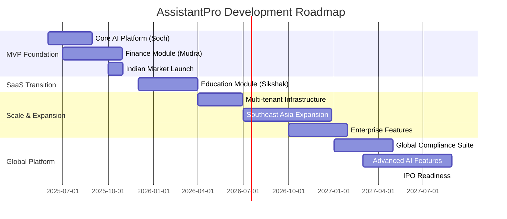

# AssistantPro Development Roadmap
## SaaS Platform Evolution Strategy

**Vision**: Become the leading AI platform for emerging markets  
**Mission**: Privacy-first, culturally-aware AI assistance for 1B+ users  
**Timeline**: 36-month roadmap to global SaaS leadership

---

## 🎯 **Strategic Phases Overview**

## 🚀 **Phase 1: MVP Foundation (Months 1-6)**
### **Goal**: Validate core AI platform with Indian consumers

#### **Month 1-2: Core AI Platform (Soch)**
- ✅ **Sarvam AI Integration**: Complete API integration with all models
- ✅ **Voice Processing Pipeline**: Speech-to-Text and Text-to-Speech
- ✅ **Cultural Context Engine**: Hinglish processing with Indian context
- ✅ **Mobile App Foundation**: React Native base with offline/online capabilities

**Deliverables**:
- Working voice AI assistant with Indian language support
- 7 production-ready Sarvam AI cookbooks implemented
- Secure authentication and data encryption

**Success Metrics**:
- <2s voice response time
- 95%+ Hinglish accuracy
- 99.9% uptime for core AI services

#### **Month 3-4: Financial Intelligence (Mudra)**
- 🚧 **SMS Transaction Parsing**: UPI and banking SMS automatic detection
- 🚧 **Offline-First Architecture**: Full functionality with/without internet
- 🚧 **Privacy-First Architecture**: End-to-end encryption with local data processing on Indian private cloud infrastructure

**Deliverables**:
- Automatic UPI transaction detection from SMS
- Comprehensive transaction categorization
- Export capabilities for financial reports

**Success Metrics**:
- 95%+ UPI transaction detection accuracy
- <3s transaction processing time
- 100% data privacy compliance

#### **Month 5-6: Market Launch & Validation**
- 📋 **Beta Testing Program**: 100+ users in Indian market
- 📋 **Performance Optimization**: Mobile app performance tuning
- 📋 **User Feedback Integration**: Rapid iteration based on user data
- 📋 **App Store Launch**: Android and iOS store deployment

**Success Metrics**:
- 100+ active monthly users
- 4.5+ app store rating
- <10% churn rate
- Positive unit economics

---

## 💼 **Phase 2: SaaS Transition (Months 7-12)**
### **Goal**: Transform into B2B2C platform with API offerings

#### **Month 7-8: Educational Module (Sikshak)**
- 📋 **Adaptive Learning Engine**: Personalized education with AI
- 📋 **Cultural Learning Adaptation**: Indian education system alignment
- 📋 **Financial Literacy Integration**: Using Indian youtuber content creator scenarios for practical learning
- 📋 **Parent/Teacher Dashboards**: Progress tracking and insights

**Deliverables**:
- Age-appropriate AI tutor (5-18 years)
- Integration with Indian curriculum standards
- Real financial data for practical money management education
- Teacher and parent monitoring through Assistant pro using groups

- 📋 **Multi-Tenant Architecture**: Shared infrastructure, isolated data
- 📋 **Usage Analytics**: Real-time monitoring and billing

**Deliverables**:

- Monthly fee based pricing model

---

## 🌍 **Phase 3: Scale & Expansion (Months 13-24)**
### **Goal**: Regional leadership and enterprise readiness

#### **Month 13-15: Infrastructure Scaling**
- 📋 **Advanced Security**: SOC 2 compliance, penetration testing
- 📋 **Performance Optimization**: Global CDN, edge computing
- 📋 **Kubernetes Deployment**: Container orchestration for scalability
- 📋 **Multi-Region Setup**: Southeast Asia data centers

**Technical Milestones**:
- Support for 100K+ concurrent users
- <100ms API response times globally
- 99.99% uptime SLA
- SOC 2 Type II certification
---

## 📊 **Key Performance Indicators (KPIs)**

### **Product Metrics**

| Phase | Users | Revenue | Markets | Features |
|-------|-------|---------|---------|----------|
| **Phase 1** | 1K users | ₹5L revenue | India | Core AI + Finance |
| **Phase 2** | 10K users | ₹50L revenue | India | + Education |
| **Phase 3** | 100K users | ₹5Cr revenue | 5 countries | + Enterprise |
| **Phase 4** | 1M users | ₹50Cr revenue | 10+ countries | Global platform |

### **Technical Metrics**

| Metric | Phase 1 | Phase 2 | Phase 3 | Phase 4 |
|--------|---------|---------|---------|---------|
| **API Response Time** | <2s | <500ms | <200ms | <100ms |
| **Uptime** | 99.9% | 99.95% | 99.99% | 99.999% |
| **Languages Supported** | 2 | 5 | 10 | 20+ |
| **Concurrent Users** | 1K | 10K | 100K | 1M+ |

### **Business Metrics**

| Metric | Target | Timeline | Priority |
|--------|--------|----------|----------|
| **Customer Acquisition Cost** | <₹1000 | Phase 1 | High |
| **Lifetime Value** | >₹10000 | Phase 2 | High |
| **Gross Margin** | >70% | Phase 3 | Critical |
| **Net Revenue Retention** | >120% | Phase 4 | Critical |

---

## 🎯 **Strategic Initiatives**

### **Technology Innovation**
1. **Advanced AI Research**: Custom language models for emerging markets
3. **Federated Learning**: Privacy-preserving model improvements
4. **Quantum-Ready Security**: Future-proof encryption methods

### **Market Expansion**
1. **University Partnerships**: Research collaborations and talent pipeline
2. **Government Relations**: Public sector AI adoption
3. **NGO Partnerships**: Digital literacy and financial inclusion

### **Competitive Advantages**
1. ** Cultural/emotional Intelligence**: Deep understanding of emerging market cultures
2. **Privacy Leadership**: End-to-end encryption with local data processing on Indian private cloud infrastructure
3. **Offline-First Design**: Resilient to connectivity issues

---

## 🚧 **Risk Mitigation**

### **Technical Risks**
- **AI Model Accuracy**: Continuous training with real user data
- **Scalability Issues**: Gradual infrastructure scaling with demand
- **Security Breaches**: Regular penetration testing and security audits
- **Data Privacy**: Legal compliance reviews in each market

### **Market Risks**
- **Competition**: Focus on cultural differentiation and privacy
- **Regulatory Changes**: Legal monitoring and compliance automation
- **Economic Downturns**: Diversified revenue streams and cost flexibility
- **Technology Shifts**: R&D investment in emerging technologies

### **Business Risks**
- **Talent Acquisition**: Competitive compensation and equity packages
- **Funding Requirements**: Multiple funding sources and revenue growth
- **Partner Dependencies**: Diversified supplier and partner network
- **Customer Concentration**: Broad customer base across segments

---

**Next Steps**: Review [Implementation Guide](./03-IMPLEMENTATION/development-setup.md) to begin Phase 1 development.

---

*Last Updated: June 4, 2025*  
*Roadmap Owner: Product & Engineering Leadership*
